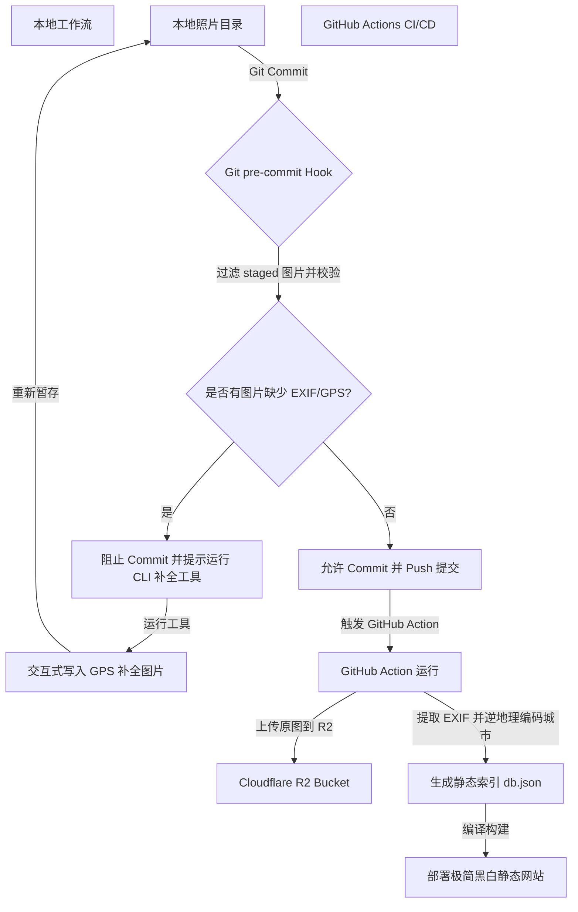

# 个人摄影作品展示网站 (Gallery) - 需求与技术设计文档 (PRD)

本项目致力于为个人摄影师打造一个极具视觉冲击力、黑白极简风格、高互动性的摄影作品展示网站。通过结合 **3D 地球仪足迹** 与 **高留白、低密度的画廊设计**，将摄影作品以时间、地点和相机参数的形式呈现。

---

## 1. 项目愿景与设计理念

*   **黑白极简美学 (Monochrome Minimalism)**: 
    *   UI 界面整体采用高度克制的黑白双色调（单色系），尽量避免彩色元素，减少视觉噪点。
    *   大幅度留白（High Negative Space），降低信息密度，营造高端画廊、纸质影集的静谧感与艺术感，将用户的视线完全聚焦于摄影作品的色彩与画面上。
*   **低对比度 3D 地球仪 (Low-Contrast 3D Globe)**: 
    *   背景融合一个暗灰/深色调的极简半透明 3D 地球仪。
    *   地球仪表面覆盖一层清透的水玻璃（毛玻璃 `backdrop-filter`）面板，形成虚实结合的空间层次。
*   **无损画质托管**: 
    *   使用云端 Cloudflare R2 存储桶托管照片。
    *   保持图片原汁原味，**不对上传的图片进行任何有损压缩**。

---

## 2. 核心功能需求

### 2.1 全屏超大缩放 3D 地球仪背景 (Full-Screen Immersive Background)
*   **全屏背景定位**: 3D 地球仪不作为局部的独立小挂件，也不采用左右分栏，而是**作为全屏的底层画布背景**存在。照片网格与 UI 元素以高透明度的玻璃质感层叠其上。
*   **国家级超大缩放尺度 (Ultra-Zoomed Scale)**:
    *   地球仪的默认相机视角**缩放极大，直接推近到“国家/地区”级尺度**（例如仅显示日本本州岛、西藏山川轮廓等）。
    *   **默认显示时，界面中不呈现完整的球体轮廓**，而更像是一幅带有微弱弧度感与网格线的 3D 浮雕地形/足迹底图。
*   **极简单色黑白材质**: 陆地仅保留淡淡的轮廓边界、细线网格或微弱粒子，海洋透明，整体对比度极低，确保作为背景时绝不喧宾夺主。
*   **无比精确的 GPS 视口过渡**:
    *   直接使用照片自带的**最精确的 GPS 经纬度数据**。
    *   当用户切换分类（如从 Japan 切换到 Tibet）或选中某张照片时，相机镜头通过平滑的 3D 地表滑行（Camera Pan/Fly-to）过渡到新区域。
    *   在精确点上展示一个极小、单色发光的微光点（Marker）。

### 2.2 首页平铺分类系统 (Homepage Flat Category System)
*   **命名规范**: 物理文件夹与分类名采用 `[时间]+[自定义后缀]` 的规范（例如 `2024.07-Japan`、`2025.03-Tibet`、`2026.05-ForestWalking`）。
*   **平铺式首页布局**: 
    *   用户首次进入网站（首页）时，**不直接展示照片，而是直接平铺列出所有的分类**。
    *   平铺设计采用极简主义排版：以纤细大字号的垂直文本列表（类似时间轴线，左侧年份，右侧自定义名称）平铺，四周留出大量呼吸感空白。
    *   **首页地球仪状态**: 在首页分类平铺状态下，背景的 3D 地球仪处于全局自动微速自转状态，或者俯瞰全景，在球面上若隐若现地标出所有去过的足迹发光点。
*   **首页滚动随动交互 (Scroll-linked Panning)**:
    *   当用户在首页上下滚动分类列表时，系统通过 Intersection Observer 监听当前处于屏幕视觉中心（或焦点位置）的分类。
    *   **背景地图会随着滚动自动将镜头挪动至当前选中分类的 GPS 坐标**。
    *   地图的挪动过程必须**非常平缓且带高阻尼渐变过渡（Damping/Easing）**，绝不能移动过快或突然跳动，确保低对比度地图在背景中如云雾般慢速流动。
*   **点击展开与视口下钻**:
    *   点击任意一个分类，该分类列表以柔和的淡入动画“下钻”展开，显示该分类下的方形照片网格（Grid）。
    *   同时，背景 3D 地球仪立即锁定该分类的第一张照片（或分类中心点）的精确 GPS，镜头平滑滑行拉近（Fly-to），切换至“国家/地区”级超大缩放尺度。
    *   页面左上角提供一个极简的返回链接（如 `← Back` 或 `Index`），点击后无缝返回首页的分类平铺状态，地球仪也随之退回全局视角。

### 2.3 Cloudflare R2 图片托管与自动化工作流 (参考 picbed 实现)
为了托管高质量无损原图并利用 Cloudflare R2 的免费流出流量，图片上传与存储遵循以下规范：

*   **同步机制 (AWS CLI s3 sync)**:
    在本地通过校验并 Push 代码到 GitHub 仓库（如 `raw` 或指定分支）后，通过 GitHub Action 工作流，使用 `aws-cli` 命令行工具将照片目录同步至 Cloudflare R2。
    *   **不同于 `picbed` 的是，本项目不使用 `cwebp` 转换或压缩，必须上传 100% 无损的高质量原图。**
*   **所需要的密钥凭证 (R2 Secrets)**:
    GitHub Action 需要配置以下 Repository Secrets：
    *   `R2_ACCESS_KEY_ID`: Cloudflare R2 API Token 的 Access Key ID。
    *   `R2_SECRET_ACCESS_KEY`: Cloudflare R2 API Token 的 Secret Access Key。
    *   `R2_ACCOUNT_ID`: Cloudflare 的账户 ID。
    *   `R2_BUCKET`: 目标 R2 存储桶名称。
*   **上传与同步命令**:
    ```bash
    aws s3 sync ./photos s3://$R2_BUCKET/gallery/ \
      --endpoint-url https://$R2_ACCOUNT_ID.r2.cloudflarestorage.com \
      --exclude "*.json" \
      --exclude "*.md" \
      --exclude ".git*"
    ```
*   **存放目的地与路径映射**:
    *   **本地存放路径**: 所有待发布照片放置在本地项目根目录下的 `/photos/[时间]-[自定义后缀]/` 文件夹（例如 `/photos/2024.07-Japan/DSC0123.jpg`）。
    *   **R2 存储桶目的地**: 同步后在 R2 存储桶中，文件将被映射至 `s3://$R2_BUCKET/gallery/[时间]-[自定义后缀]/[照片名称]`。
    *   **公网直链访问**: 前端静态网页通过自定义的 R2 域名或 Cloudflare 绑定的自定义域名，以 `https://<R2_CUSTOM_DOMAIN>/gallery/[时间]-[自定义后缀]/[照片名称]` 的 URL 无损渲染图片。

### 2.4 本地 EXIF/GPS 检查与编辑工具 (CLI Utility & Git Hook)
为了百分之百保证发布的照片拥有完整的地理与相机参数，项目提供**本地命令行脚本工具**以及 **Git 强校验机制**：
*   **检查模式 (Check Mode)**: 自动扫描本地图片目录，检测照片中是否包含 EXIF 参数（相机、镜头、快门等）以及是否包含 GPS 经纬度。
*   **编辑模式 (Edit Mode)**: 如果照片缺少 GPS 或 EXIF 信息，提供友好的命令行交互，引导用户输入 GPS/地点，并自动写入图片文件中。
*   **Git pre-commit 钩子强制校验 (Git Hook Enforcement)**:
    *   引入 Git Hook 管理工具（如 **`husky`** 或 **`simple-git-hooks`**）。
    *   在执行 `git commit` 前自动拦截，运行脚本通过 `git diff --cached --name-only` 过滤出本次暂存（staged）的图片文件。
    *   对本次提交的图片进行 EXIF/GPS 检查，**如果任何一张图片缺少必要元数据，直接中断 Commit 提交 (Exit Code 1)**，并输出红色警告提示用户运行 CLI 编辑模式进行补全。这能彻底杜绝“由于疏忽提交了没有 GPS 的照片而导致 3D 地球仪无法定位”的问题。

### 2.5 极致留白的照片详情与城市级定位
*   **大图沉浸弹窗模式**:
    *   点击方形缩略图后，照片以放大姿态展示在最前端。
    *   对于尺寸/纵横比不足以填满整个视口的图片（如竖图或特殊比例图片），**屏幕剩余的所有背景及边框区域使用有透明度的黑色遮罩（如 `rgba(0, 0, 0, 0.85)`）进行覆盖遮盖**，从而彻底隔绝背景中 3D 地球仪及其他 UI 的干扰，营造极致专注的观影感。
*   **大图缩放交互 (Interactive Zooming)**:
    *   **PC 端**: 支持通过**鼠标滚轮 (Mouse Wheel)** 对大图进行自由缩放，缩放时以鼠标悬停点为中心点进行平滑放大/缩小。
    *   **移动端**: 支持**双指捏合缩放 (Pinch-to-zoom)**，以便手机用户细致放大查看画面细节与质感。
*   **退出/关闭大图交互 (Dismissing)**:
    *   **点击外部区域退出**: 点击大图照片外部的半透明黑色遮罩区域，即可关闭并退出大图，无缝返回方形照片网格视图。
    *   **按键退出**: 在键盘上按 **`Esc` 键** 可随时关闭并退出大图详情模式。
*   **多维导航切换**:
    *   支持**鼠标左右点击**：大图左右两侧提供极简隐形方向按钮，点击切换上一张/下一张。
    *   支持**键盘方向键切换**：按键盘 `←` 和 `→` 键可实现上一张/下一张切换。
    *   支持**手势滑动**：移动端支持左右滑动手势切换。
*   **横向滑动切图动效 (Sliding Transition)**:
    *   左右切换照片时，照片不采用简单的淡入淡出（Crossfade），而是**带有横向滑动的动画效果**。
    *   切换时，旧图片顺滑地向一侧滑出视口，新图片同步从另一侧平滑滑入居中，伴随轻微的摩擦力阻尼感，使多张照片的浏览如拉动实体卷轴一般。
*   **信息展示**: 
    *   **不展示任何自定义的长篇大论或故事文字**，保持界面极简。
    *   **仅展示地点（精确到城市级）**：例如 "Tokyo, Japan" 或 "Lhasa, China"。
    *   **展示关键 EXIF 信息**：如相机型号、镜头、焦距、光圈、快门、ISO。
*   **城市级地点获取**:
    *   为了将精确的 GPS 转化为用户可读的城市名称，构建脚本（Build-time）在扫描照片 GPS 时，通过轻量级离线逆地理编码（Reverse Geocoding）库自动将经纬度转换为“城市/国家”名称，并写入索引。

---

## 3. 技术方案设计 (Technical Architecture)

### 3.1 核心技术栈
*   **前端框架**: Vite + React (TypeScript) — 能够快速组装极简黑白 UI 且完美适配 Three.js 生态。
*   **3D 渲染**: `react-globe.gl` 或原生的 Three.js，配置为 Monochrome（单色）渲染风格。
*   **本地检查脚本**: Node.js 命令行脚本 + `exifr`（读取）+ `exiftool-vendored` 或类似库（写入）。
*   **图片托管**: Cloudflare R2 + GitHub Action 工作流（使用 S3 API 同步命令，不执行压缩）。
*   **地点解析**: 离线逆地理编码（如 `local-reverse-geocoder`）或 build 阶段在线 API 请求缓存。

### 3.2 离线构建与发布工作流


### 3.3 图片加载与性能优化方案 (Image Loading & LCP Optimization)
虽然 Cloudflare R2 存储桶中保存的是**无损未压缩的原图**，但如果前端在照片网格中直接加载多张数兆（MB）甚至数十兆的原始图片，会导致严重的加载卡顿、高额流量消耗以及极差的 LCP 性能。
为此，采用 **双路径存储方案 (Dual-Path Storage)**：
*   **原图存储区 (Raw Storage)**: 在 R2 存储桶的 `s3://$R2_BUCKET/gallery/[分类]/raw/` 下保存 100% 无损的高清原图，仅在用户点击进入“大图详情查看”时加载或供用户下载。
*   **缩略图存储区 (Thumbs Storage)**: 在 GitHub Actions 构建阶段，通过 `sharp` 库自动读取图片，生成一张宽度为 400px~600px 左右的轻量级 WebP/JPEG 缩略图，存放在 R2 存储桶的 `s3://$R2_BUCKET/gallery/[分类]/thumbs/` 下。照片网格（Grid）默认仅拉取缩略图，确保网站首屏及滚动时的绝对流畅。

### 3.4 地理位置逆解析缓存策略 (Reverse Geocoding & Build-time Cache)
精确 GPS 转换为“城市，国家”名称的解析过程全部放在 **GitHub Actions 构建阶段（Build-time）** 完成，前端不进行任何运行时的地理位置 API 请求：
1.  **API 请求与缓存**: 构建脚本解析出照片的 GPS 经纬度后，向免费逆地理编码服务（如 OpenStreetMap Nominatim）发送请求获取城市和国家名称。
2.  **构建缓存机制**: 为了防止因为照片过多频繁请求 API 触发限频（Rate Limit），构建脚本会维护一个本地的 `.geocache.json` 缓存文件。如果经纬度与缓存中的坐标距离在 500 米以内，则直接使用缓存中的城市信息，避免重复请求，确保构建效率。

### 3.5 URL 路由与直链分享 (URL Routing & Deep Linking)
为了方便用户分享特定的相册或某张具体照片，网站使用 **URL Hash 路由机制**：
*   **分类直链**: 格式为 `/#/[分类名称]`（如 `/#/2024.07-Japan`），可直接跳转并定位到对应的相册。
*   **单张照片直链**: 格式为 `/#/[分类名称]/[照片名称]`（如 `/#/2024.07-Japan/DSC_0123`），可直接打开大图查看器并展示特定照片，地球仪背景将自动飞跃到该照片的精确拍摄位置。

### 3.6 WebGL 降级与兼容性 (WebGL Fallback & Degradation)
如果访问者的设备/浏览器不支持 WebGL（例如某些低端设备或隐私模式浏览器），或者 3D 地球仪初始化失败：
*   **静态度量降级**: 界面将平滑降级，移除底层 3D 地球仪，改用一张精致的极简单色（Monochrome）暗色/亮色静态平面世界地图作为背景。
*   **功能不中断**: 照片网格、分类选择和大图详情浏览功能完全不受 WebGL 状态影响，保障网站的基础可用性。

---

## 4. 界面与视觉设计规范 (Visual Guidelines)

### 4.1 视觉风格
*   **排版**: 使用大字号、细字重（Light/Thin）的无衬线或优雅的衬线字体，字间距（letter-spacing）拉宽，营造呼吸感。
*   **色调控制**: 
    *   背景: `#ffffff` (亮色画廊) 或 `#0a0a0a` (暗色影棚)。
    *   文字: `#222222` 或 `#e5e5e5`。
    *   地球仪: 极低对比度底色，例如用 `#1a1a1a` 陆地配 `#0a0a0a` 海洋，或线框结构。
*   **布局密度**: 界面上单屏展示的元素极少。照片四周留出大量空白，不紧贴屏幕边缘。

### 4.2 动效设计规范
*   **地图随动高阻尼缓动 (Damped Camera Transition)**:
    *   无论是在首页滚动列表触发的地图随动，还是分类下钻触发的 Fly-to，相机在地表滑行的动画必须带有**高度的物理阻尼感 (Damping/Inertia)**。
    *   过渡曲线采用类似 `cubic-bezier(0.25, 1, 0.5, 1)`（由快变极慢），使镜头在滑行终点前产生柔和的减速消散效果，杜绝任何生硬的物理刹车感。
*   **大图横向滑动切换 (Horizontal Slide Transition)**:
    *   照片左右切换时，使用 CSS 硬件加速（Translate3D）实现流畅的横向平移。
    *   滑行动效同样加入轻微的阻尼，使前一张照片滑出与后一张照片滑入时的速度曲线自然优雅。
*   **首屏载入与模糊渐显 (Blurry Load)**:
    *   网站首次进入时，文字链和背景地图从纯色中极其柔和地淡入（Fade-in 1.5s）。
    *   大图及缩略图载入时，配合 CSS `filter: blur(10px) -> blur(0px)` 的渐变展示，防止图画瞬间闪现造成的刺眼感。

### 4.3 移动端自适应规范 (Mobile Responsive Guidelines)
为了给手机用户带来同样极简、奢华的体验，网站界面必须实现全自适应响应式布局：

*   **3D 地球仪适配**:
    *   **PC 与移动端一致性**: 地球仪在 PC 与手机上**均作为全屏底层背景**。
    *   **手机端超低对比度控制**: 
        *   由于手机屏幕尺寸受限，在移动端（竖屏）下，地球仪的线条、网格以及地标光点的透明度（Opacity）和对比度将自动进一步降低（甚至降为极淡的底噪灰度，如亮色模式下为 `#fafafa`，暗色模式下为 `#0e0e0e`）。
        *   这样可以完全保证上层的 2 列方形照片网格和关键文本信息拥有绝对清晰的可读性，避免因地球仪背景干扰产生视觉疲劳。
*   **照片网格布局**:
    *   根据屏幕宽度（Media Queries）自动调整网格列数：
        *   宽屏 (Desktop): 4 列或 5 列网格。
        *   平板 (Tablet): 3 列网格。
        *   手机 (Mobile): 2 列网格，间距（gap）缩小至 8px~12px，两边留出足够宽的白边，保持呼吸感。
*   **大图详情弹窗**:
    *   **PC 端**: 左右分栏（左大图，右 EXIF 信息看板）。
    *   **移动端**: 转换为**上下分栏**结构，大图在上方，EXIF 信息在下方收纳；支持**双击放大**或**捏合缩放（Pinch-to-zoom）**，并支持**左右滑动手势（Swipe）**切换照片。
*   **分类菜单与导航**:
    *   **扁平导航流**: 废除复杂的抽屉或侧边常驻菜单。用户在二级照片页面时，仅通过左上角固定的极简返回按钮（`← Index`）返回首页。
    *   在小屏设备上，返回按钮和当前分类名采用微型毛玻璃悬浮条形式固定在顶部，既方便点击，又释放了屏幕空间。

---

## 5. 待讨论与后续步骤 (Next Steps)

虽然不立即开始编写代码，但在后续方案设计中我们将重点落实：

> [!NOTE]
> 1.  **本地 CLI 工具依赖**: 本地检查写入工具可使用 Node.js 封装 `exiftool`（跨平台且非常稳定），我们需要在文档中说明如何安装它。
> 2.  **逆地理编码服务**: 在 GitHub Actions 构建阶段，我们将使用免费的离线地理数据库或缓存式地理解析，保证编译不会因为 API 限制或网络问题失败。
